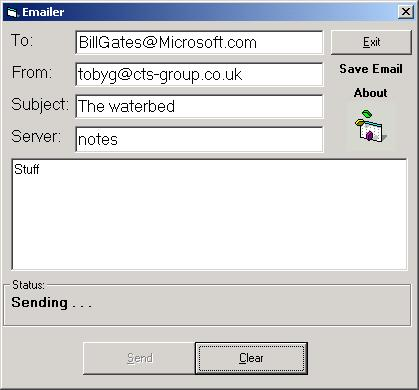



## Emailer

### Description

This is basically a program for sending E-mails, great code if you want to learn Winsock as it is fully commented. The emails show up as being from whatever you type in. Hope this is helpful.

Any feedback as in comments, suggestions, deaththreats, marriage proposals will be greatly appreciated.

Thanks...
 
### More Info
 

             |
---                |---
**Submitted On**   |2000-08-19 11:38:16
**By**             |[Toby Gunston](https://github.com/Planet-Source-Code/PSCIndex/blob/master/ByAuthor/toby-gunston.md)
**Level**          |Intermediate
**User Rating**    |4.7 (33 globes from 7 users)
**Compatibility**  |VB 6\.0
**Category**       |[Miscellaneous](https://github.com/Planet-Source-Code/PSCIndex/blob/master/ByCategory/miscellaneous__1-1.md)
**World**          |[Visual Basic](https://github.com/Planet-Source-Code/PSCIndex/blob/master/ByWorld/visual-basic.md)
**Archive File**   |[CODE\_UPLOAD90728182000\.zip](https://github.com/Planet-Source-Code/toby-gunston-emailer__1-10783/archive/master.zip)

